# Advanced Lane Finding Project #
[](http://www.udacity.com/drive)


## The goals of the project ##

* Compute the camera calibration matrix and distortion coefficients given a set of chessboard images.
* Apply a distortion correction to raw images.
* Use color transforms, gradients, etc., to create a thresholded binary image.
* Apply a perspective transform to rectify binary image ("birds-eye view").
* Detect lane pixels and fit to find the lane boundary.
* Determine the curvature of the lane and vehicle position with respect to center.
* Warp the detected lane boundaries back onto the original image.
* Output visual display of the lane boundaries and numerical estimation of lane curvature and vehicle position.

## Main Project Structure ##

- [image_processing modules](./image_processing): python module for preprocessing method of images, such as thresholding
- [lane_line_detector.py](./lane_line_detector.py): implementation of LaneLineDetector class
- [notebooks/lane_detection_pipeline.ipynb](./notebooks/lane_detection_pipeline.ipynb): jupyter notebook to show processes of detecting lane lines using image_processing modules and LaneLineDetector

## [Rubric](https://review.udacity.com/#!/rubrics/571/view) Points

---

### Writeup / README

### Camera Calibration

The code for this step is contained in the third code cell of the IPython notebook located in [notebooks/lane_detection_pipeline.ipynb](./notebooks/lane_detection_pipeline.ipynb).
The main steps for camera calibration are as following:
- convert the BGR image (read by cv2) to gray scale
- prepare object points, which will be the (x, y, z) coordinates of the chessboard corners in the world.
- find chessboard corners, use the detected corners as image points
- use object points and image points to compute the camera calibration matrix and the distortion coefficients
- apply the values of camera calibration matrix and the distortion coefficients to undistort original image

The following two images are the result of undistortion, with the image on the left is the original chessboard image and the image on the right is undistorted chessboard image.

<p float="center">
  
  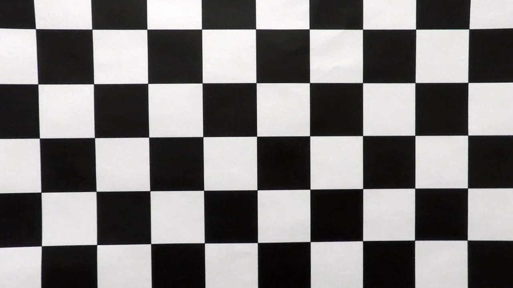
</p>

### Pipeline (single images)

#### 1. An example of a distortion-corrected image.

I use the camera calibration matrix (mtx) and distortion coefficients (dist) to apply the distortion correction to one of the test images like this one:
<p float="center">
  
  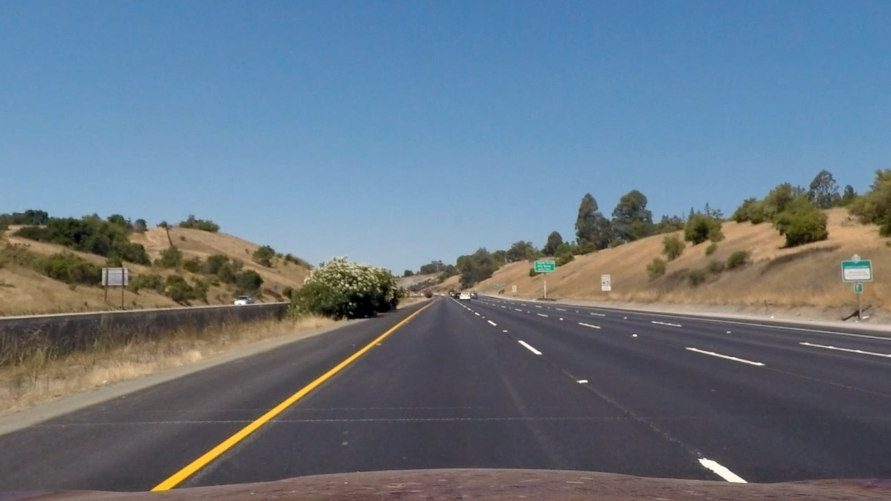
</p>

#### 2. Perspective Transformation

The code for my perspective transform includes a function called `warper()`, which appears in from line 28 to line 54 the script `lane_line_detector.py` (output_images/examples/example.py)

I chose the hardcode the source and destination points in the following manner:

```python
self.HEIGHT = self.img.shape[0]
self.WIDTH = self.img.shape[1]

self.__src = src = np.float32(
    [
        [self.WIDTH // 2 - 60, 450],
        [self.WIDTH // 2 + 60, 450],
        [100, self.HEIGHT],
        [self.WIDTH - 100, self.HEIGHT],
    ]
)

self.__dst = dst = np.float32(
    [
        [self.offset, self.offset],
        [self.WIDTH - self.offset, self.offset],
        [self.offset, self.HEIGHT],
        [self.WIDTH - self.offset, self.HEIGHT],
    ]
)
```

This resulted in the following source and destination points:

| Source        | Destination   |
|:-------------:|:-------------:|
| 580, 450      | 200, 200        |
| 700, 450      | 1080, 200      |
| 100, 720     | 200, 720      |
| 1180, 720      | 1080, 720        |

<p float="center">
    
    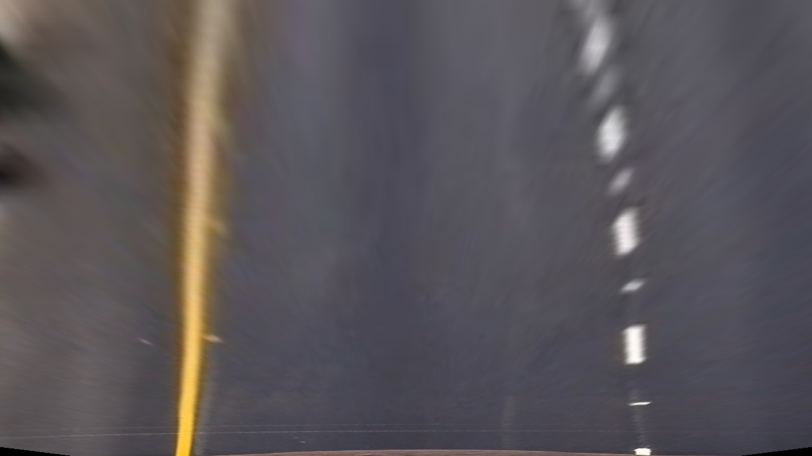
</p>

#### 3. Color transformation and thresholding
I used a combination of color and gradient thresholds, which are summed up in the script filtering.py of [image_processing](./image_processing) module
to generate a binary image.
I apply thresholding on HSV color space to get yellowish pixels, and also apply thresholding on RGB color space to obtain whiteish pixels. This process can be seen in [thresholding_on_color](./image_processing/filtering.py#L66-L75) method of [filtering.py](./image_processing/filtering.py) script.
I further transform the image into HLS color space, and apply sobel filter on S channel image, then apply thresholding on the filtered image. This can be seen in [line 84-85 of filtering.py script](./image_processing/filtering.py#L84-L85).

Finally, I combine all the thresholding result with OR operator to get one of the following results:

<p float="center">
    
    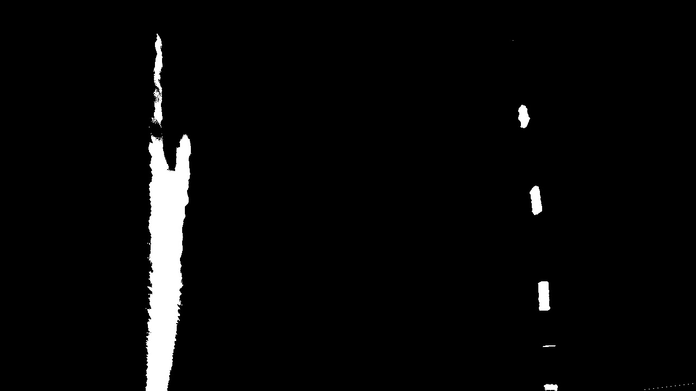
</p>

#### 4. Polynomial fitting

The polynomial fitting process of a single image can be seen in [line 62-163 of lane_line_detector.py](./lane_line_detector.py#L62-L163).
The underlying algorithms can be described roughly as following:
- calculate histogram of pixels on binary thresholded warped image.
- find the local maximal on the left and right side of the histogram.
- use multiple sliding windows to collect non-zero pixels to form 2 group of non-zero pixels on the left and right side of the image.
- fit a polynomial on each of the group of non-zero pixels to find the line model on the left and the right

The following images show the non-zero pixels, sliding windows and the fitted lines.

<p float="center">
    
    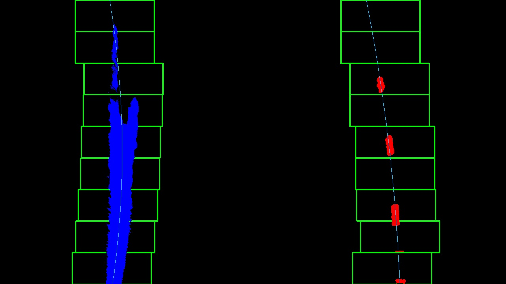
</p>

The process of fitting polynomial on a sequence of frames (video) can be fastened using the fitted line model of the previous frame as prior. Here, without using sliding windows, we find non-zero pixels at the regions around the fitted line (of the previous frames) defined by a margin. After finding two group of non-zero pixels on the left and the right using this method, we again fit a polynomial on the newly found non-zero pixels. This can be seen in the [fit_polynomial_with_prior](./lane_line_detector.py#L165) method of lane_line_detector.

#### 5. Calculation of the radius of curvature of the lane and the position of the vehicle with respect to center

I did this in [estimate_lane_parameters](./lane_line_detector.py#L224) method of LaneLineDetector class.
I use a second order polynomial curve to fit the lane pixels, which can be expressed as:
```
f(y) = A * y^2 + B * y + C
```
The radius of curvature hence can be calculated as:
```
R_{curve} = (1 + (2 * A * y + B) ^ 2) ^ (3 / 2) / |2 * A|
```
I calculate the radius of curvature on the left and right side of the image then use the average value of the two as the radius of curvature of the road.
For the position of the ego vehicle, I calculate the x coordinates of the two curves at the maximum y. The x coordinate of the ego vehicle then be represented by the average value of these two x coordinates of the two curves. Comparing the x coordinate of the ego vehicle and the center point (of the image) gives us the information about whether the ego vehicle is on the left or the right.

#### 6. Final result

The visualization of the final result can be observed in the [visualize_result](./lane_line_detector.py#L251) method of LaneLineDetector class.
The final results for the test images are as following:

<p float="center">
    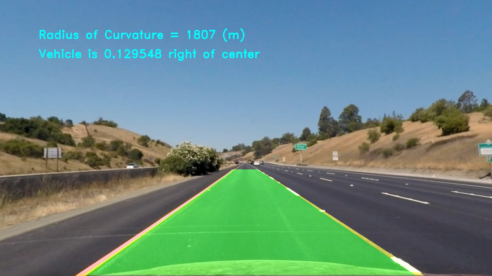
    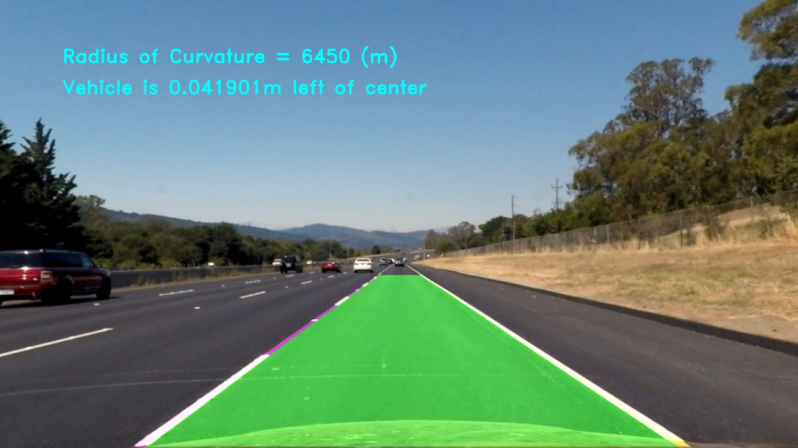
</p>
<p float="center">
    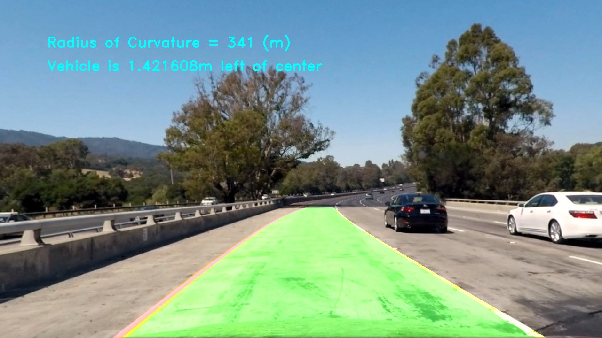
    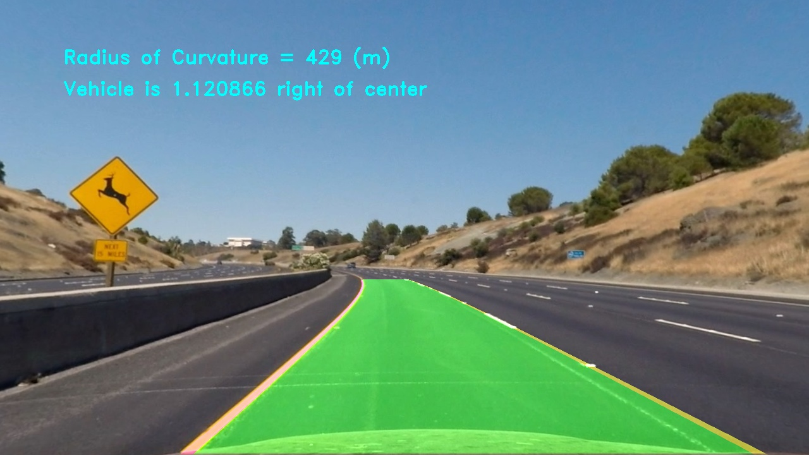
</p>
<p float="center">
    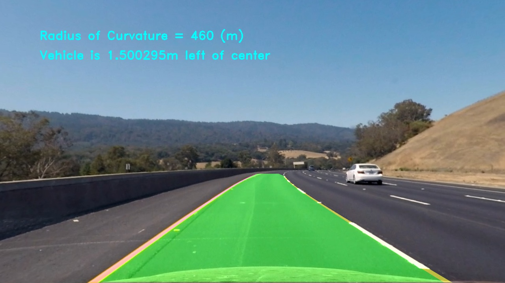
    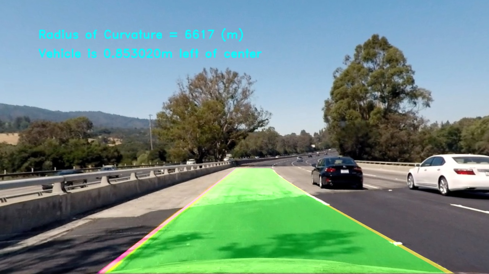
</p>
<p float="center">
    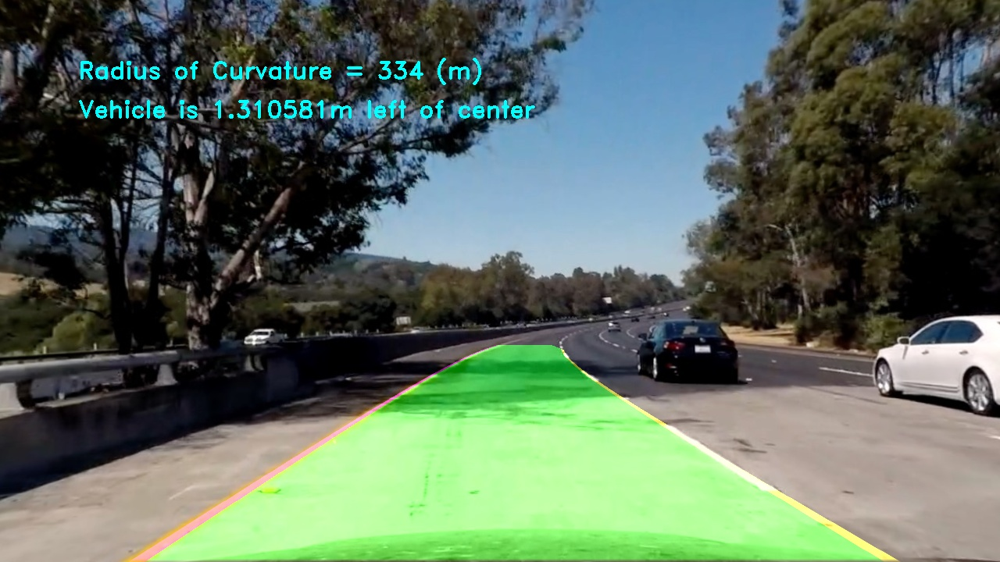
    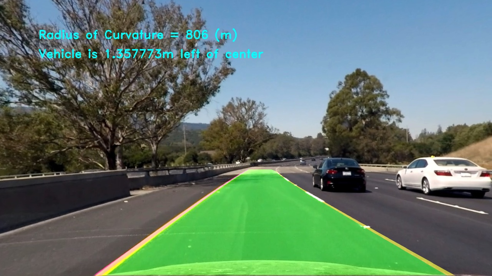
</p>

---

### Pipeline (video)

#### 1. Pipeline for the video

The pipeline for the test video can be seen in the 13th cells of lane_line_pipeline.ipynb notebook.
Note that for the video, I only used the sliding window technique for the first frame of the video. For the following frames, I use the previously fitted curve model as a prior to find the new non-zero pixels.

Here's an example: [link to my video result](./output_videos/output_project_video.mp4)

---

### Discussion

This pipeline for lane line detection works with a lot of heuristic information from the thresholding values to chosen source and destination points for image warping, which luckily works on the first basic test video.
For the challenge videos, the existence of shadow on the road, obstacle ahead (the driver), complicated structure of the curve (which a second order polynomial can not represent) make it very hard for the current approach to work robustly.
Further image processing technique like shadow removing, bezier/ b spline curve fitting, or ultimately yreal-world recognition with deep learning (that is briefly introduced in the lession) should be applied for the autonomous driving system to become reliable and workable.
